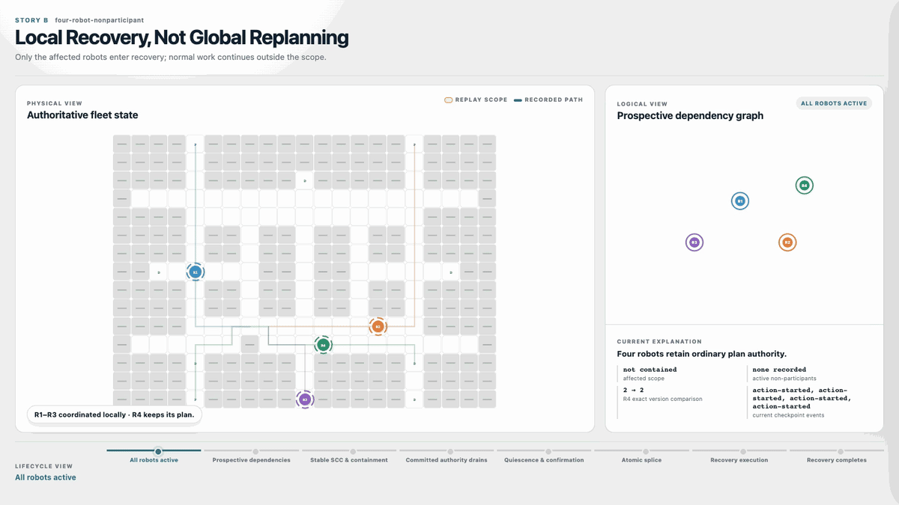
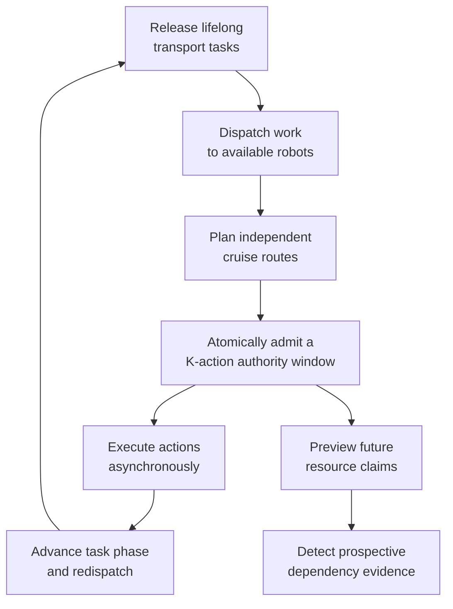
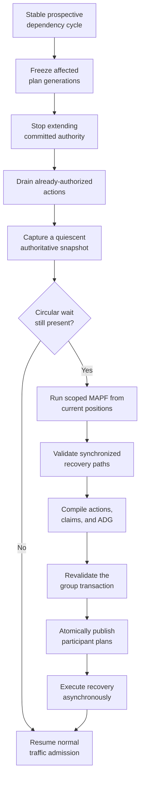
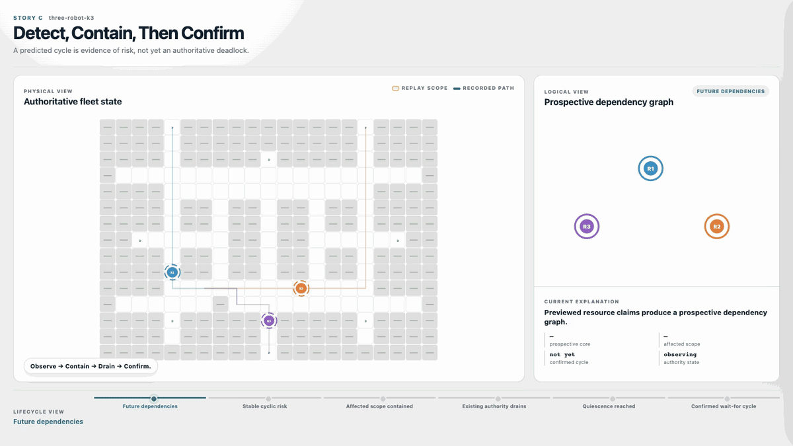
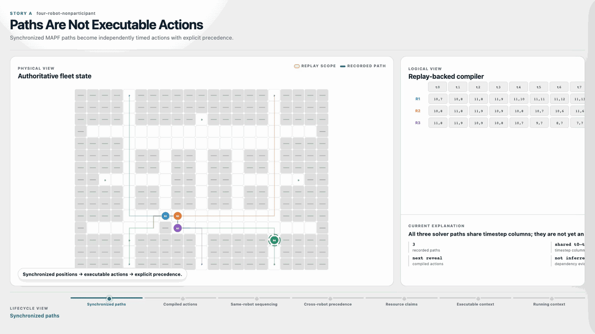
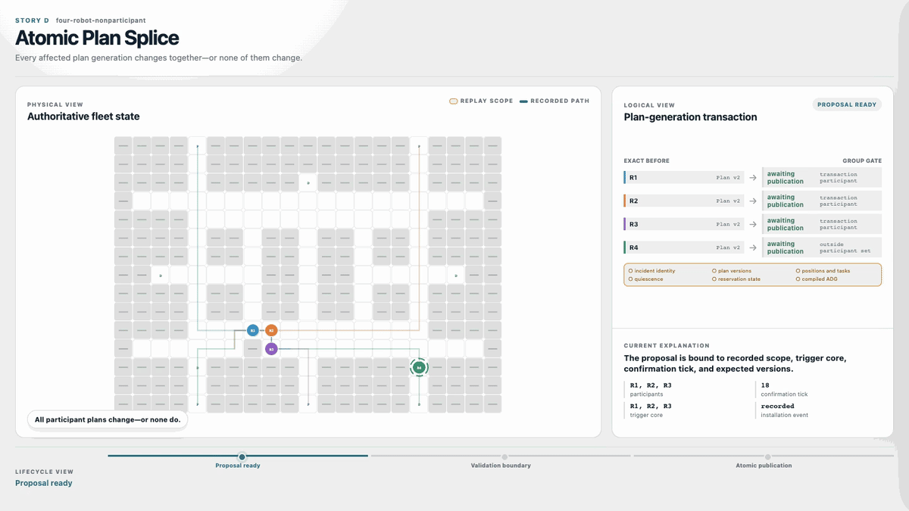
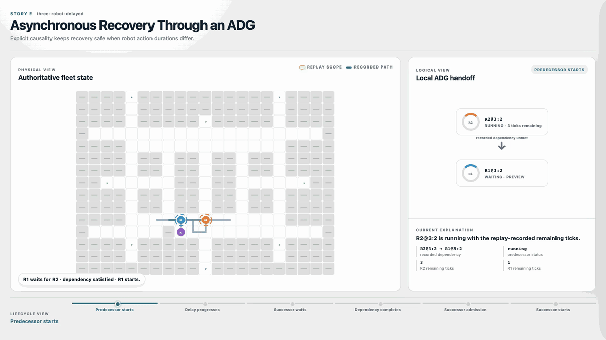
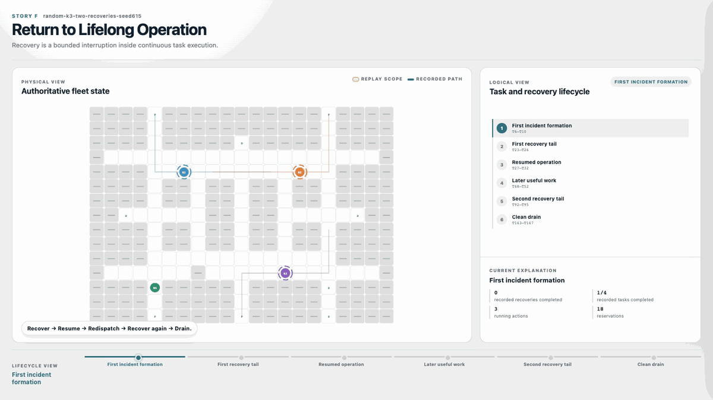

# MAPF Splice

**A reference architecture for inserting scoped MAPF recovery into a continuously running, asynchronous AMR fleet.**

MAPF research usually ends when a solver returns collision-free synchronized
paths. A fleet-management system still has to answer the harder integration
questions:

- Which robots should stop, and which should keep working?
- When is a predicted resource cycle an actual deadlock?
- How can synchronized paths run on robots with unequal action durations?
- How can several live plans be replaced without exposing a partial state?
- How does recovery return control to ordinary dispatch and traffic admission?

MAPF Splice implements that control boundary. Normal operation remains
independent routing plus rolling traffic authority. MAPF is invoked only as a
bounded intervention for a confirmed local deadlock.

<p align="center">
  
</p>

> **The central claim:** R1–R3 can enter a coordinated recovery transaction
> while R4 remains active, keeps its current plan generation, and continues to
> arbitrate traffic through the same global occupancy and reservation authority.

## The operational scenario

Consider a live warehouse fleet rather than an isolated MAPF instance:

1. Robots receive pickup-and-delivery tasks continuously.
2. Each robot follows an independently planned route.
3. A rolling committed window grants exclusive motion authority over the next
   `K` actions; a read-only preview looks another `K` actions ahead.
4. Previewed resource claims form a prospective dependency cycle among a local
   subset of robots.
5. Unrelated robots may still be moving and must not be pulled into a global
   replan.
6. Already-authorized actions cannot simply be revoked; they must drain to a
   deterministic action boundary.
7. A recovery solver returns synchronized paths, but the fleet executor remains
   asynchronous and versioned.

The project is built around this integration problem, not around implementing a
new general-purpose MAPF algorithm.

## End-to-end architecture

### Normal fleet operation



### Local recovery intervention



The recovery controller therefore follows a strict sequence:

```text
observe → stabilize → contain → drain → confirm
        → solve → compile → validate → atomically splice → resume
```

It never treats preview evidence as committed authority, never assumes that a
solver path is directly executable, and never installs participant plans one at
a time.

## Key design decisions

### 1. Prediction and authority are different data

The preview horizon is advisory. It may expose future contention and
prospective blocker edges, but it never owns a vertex or edge and cannot evict a
committed claim. Deadlock confirmation is rebuilt only after the affected plans
reach quiescence, using current positions and committed resources.

This prevents a transient SCC in a look-ahead graph from being mislabeled as an
authoritative deadlock.

### 2. Recovery scope is local; safety authority remains global

Only the confirmed affected scope is sent to MAPF and plan replacement.
Non-participants keep their current plans. They are not ignored, however:
normal and recovery traffic still arbitrate against the same global occupancy
and reservation ledger.

A moving robot outside the participant set can therefore delay recovery
admission without being silently converted into part of the recovery problem.

### 3. A MAPF path is compiled, not executed directly

The solver boundary returns synchronized position sequences. Before runtime
installation, MAPF Splice validates them and compiles them into executor-native
objects:

- finite `move` and `wait` actions;
- deterministic action identities `(robot_id, plan_version, action_index)`;
- same-robot sequencing;
- cross-robot precedence for shared resources;
- explicit vertex and edge claims;
- an Action Dependency Graph (ADG) that must be acyclic.

The result preserves the causal ordering of the synchronized solution without
requiring the robots to move in lockstep.

### 4. Recovery installation is a multi-robot transaction

A recovery proposal is bound to a specific incident, confirmation tick, affected
scope, trigger core, and expected plan versions. Before mutation, the system
revalidates the complete group:

- incident identity and participant set;
- current plan generations;
- authoritative positions and task phases;
- quiescence and reservation state;
- replacement-plan starts and compiled ADG validity.

All participant generations are then published together—or the world remains
unchanged. A stale proposal cannot partially replace a live fleet.

### 5. Cruise authority and recovery authority are not conflated

Normal execution acquires its initial `K`-action committed window atomically.
Recovery execution is dependency-aware and action-boundary oriented. Both use
the same authoritative ledger, but they are intentionally different admission
profiles rather than one policy forced onto two execution models.

### 6. Observability cannot change the answer

The simulation kernel emits deterministic, immutable replay snapshots. The Web
Inspector only consumes those snapshots; it does not route, reserve resources,
derive dependency graphs, calculate SCCs, or mutate runtime state.

This keeps visual explanation, test evidence, and system behavior on the same
recorded timeline.

## Getting started

MAPF Splice is a pure-Python project managed with [uv](https://docs.astral.sh/uv/).
uv provisions a compatible interpreter automatically, so a preinstalled system
Python is not required.

### Prerequisites

| To… | Requirements |
| --- | --- |
| Run the simulator and Web Inspector | [uv](https://docs.astral.sh/uv/getting-started/installation/); Python ≥ 3.11 (uv can install it) |
| Develop and run the tests | the above; *optionally* Node.js, Playwright, and Chromium for the browser-based Story Display tests |
| Regenerate the story media | the above, plus Node.js, Playwright with Chromium, FFmpeg, and FFprobe |

The vendored recovery solver (NumPy) and the developer tools (pytest, ruff) are
installed automatically by `uv sync`. The Inspector is a static offline page
rendered by your browser, so Node.js is **not** needed to view the stories —
only to run the browser tests or capture media.

### Installation

```bash
git clone <repository-url>
cd mapf-splice
uv sync --frozen
```

`uv sync --frozen` reproduces the exact locked environment from `uv.lock`.

### Quick start

Serve the Web Inspector over the canonical v0.1 corpus:

```bash
uv run mapf-splice-inspect --lifelong-cases validation/lifelong
```

The command prints `MAPF Splice Inspector: http://127.0.0.1:8765` and opens that
page in your browser. It loads an eight-case catalog and plays the six Story
Displays (A–F), backed by canonical replays from the same deterministic kernel
the tests exercise. Add `--no-open` to serve without launching a browser, or
`--port <n>` to change the port.

### Verify the installation

A fast smoke test over the deterministic validation corpus:

```bash
uv run pytest tests/test_lifelong_validation.py -q
```

The full suite:

```bash
uv run pytest -q
```

The browser-based Story Display tests skip automatically when Node.js,
Playwright, or Chromium are unavailable; every other test runs from a bare
`uv sync` install.

## How to read the replays

Each story display presents three synchronized views:

- **Physical view** — authoritative positions, routes, committed motion, and
  recovery scope.
- **Logical view** — dependency graphs, ADG handoffs, plan-generation
  transactions, or lifecycle state.
- **Lifecycle view** — the exact recorded stage or checkpoint currently shown.

The six stories below are ordered by the runtime argument rather than by their
letter labels.

## Executable design evidence

### Story B — Local Recovery, Not Global Replanning

**Question:** Can the controller coordinate only the robots involved in the
incident while an unrelated robot remains active?

<p align="center">
  
</p>

**What to inspect**

- R1–R3 become the affected scope and drain their existing authority.
- R4 stays outside the participant set and retains its exact plan generation.
- R4 still participates in global occupancy and reservation arbitration.
- The replay retains all 82 emitted runtime items from T12 through T34.

This is the core fleet-level decision: **coordinate locally without pretending
the rest of the fleet disappeared.**

### Story C — Detect, Contain, Then Confirm

**Question:** How does the controller avoid treating every predicted cycle as a
hard deadlock?

<p align="center">
  
</p>

**What to inspect**

- The initial graph is prospective evidence derived from future claims.
- A stable SCC triggers containment, not immediate MAPF execution.
- Already-committed actions drain before confirmation.
- The final wait-for graph is rebuilt from authoritative state and is visibly
  different from the preview graph.

The distinction is operationally important: **risk prediction decides where to
look; current authority decides whether recovery is justified.**

### Story A — Paths Are Not Executable Actions

**Question:** What must happen between a synchronized MAPF result and a real
asynchronous executor?

<p align="center">
  
</p>

**What to inspect**

- Three synchronized solver paths are converted into 33 recorded actions.
- Same-robot ordering is explicit rather than implied by array position.
- Ten cross-robot edges preserve the ordering of shared-resource visits.
- Resource claims become part of the executable plan, not UI annotations.

The solver produces spatial coordination; the compiler produces a runtime
contract.

### Story D — Atomic Plan Splice

**Question:** How can several affected plans be replaced without exposing a
half-installed recovery?

<p align="center">
  
</p>

**What to inspect**

- The proposal passes one validation boundary for the complete participant set.
- R1–R3 change from plan generation `v2` to `v3` in one recorded publication.
- R4 remains exactly at `v2` because it is outside the transaction.
- A failure before publication would leave every robot, reservation, and plan
  version unchanged.

This is optimistic concurrency control applied to live multi-robot plans.

### Story E — Asynchronous Recovery Through an ADG

**Question:** Does the recovery remain safe when robot actions take different
amounts of time?

<p align="center">
  
</p>

**What to inspect**

- R2 is still running while R1's successor action remains non-running.
- The dependency is recorded against concrete action identities.
- R1 becomes admissible only after R2 completes the predecessor action.
- No wall-clock synchronization or simultaneous start is required.

The ADG preserves MAPF causality while the executor remains independently
timed.

### Story F — Return to Lifelong Operation

**Question:** Is recovery integrated into continuous fleet work, or does the
demo stop once the robots escape the first incident?

<p align="center">
  
</p>

**What to inspect**

- The first recovery completes and normal task execution resumes.
- Robots perform later useful work and are redispatched.
- A second recovery occurs inside the same lifelong run.
- The system reaches a clean terminal drain after 14 recorded tasks complete.
- Five explicitly labeled montage gaps disclose every presentation-only skip.

Recovery is therefore a bounded control episode inside the task lifecycle, not
a special terminal mode.

## Responsibility boundaries

The implementation is organized around ownership rather than around one large
"fleet manager" object:

- **Domain state** owns robots, tasks, actions, versioned plans, reservations,
  and aggregate invariants.
- **Dispatch and routing** choose tasks and spatial routes but do not own traffic
  authority.
- **Traffic admission** owns the committed ledger, batch arbitration, rolling
  windows, and read-only preview evidence; it does not classify deadlocks.
- **Deadlock analysis** owns prospective SCC stability, affected-scope
  selection, containment, and authoritative wait-for confirmation.
- **Recovery orchestration** owns incident-bound proposals, scoped solver calls,
  validation, and atomic plan replacement.
- **MAPF and compiler adapters** isolate solver-specific data and translate
  synchronized paths into validated actions and ADG dependencies.
- **Execution** advances actions in deterministic phases and rejects stale plan
  generations.
- **Replay and Inspector** provide read-only evidence and cannot influence the
  kernel.

These boundaries let a production system replace the solver, dispatcher,
visualizer, or external robot adapter without moving safety and authority rules
out of the core model.

## Correctness model

The system uses one authoritative `WorldState` and a deterministic phased tick
loop. Asynchrony is represented by multi-tick action duration and explicit
waits—not by nondeterministic threads or animation timing.

Core invariants include:

1. A vertex cannot be occupied by more than one robot.
2. Two robots cannot traverse the same undirected edge in opposite directions
   during overlapping intervals.
3. A committed resource belongs to one plan generation.
4. A stale action, completion, or proposal cannot mutate a newer plan.
5. An action cannot start before its dependencies complete and its claims are
   valid.
6. Planning may release unexecuted future reservations; it may not release
   current occupancy by assumption.
7. Preview claims never own resources and cannot displace committed authority.
8. Solver or transaction failure leaves the fleet in a diagnosable fail-safe
   state without partial installation.

See [System architecture and invariants](docs/ARCHITECTURE.md) for the detailed
execution phases and validation rules.

## Reproduce the published media

The checked-in GIFs are generated by a capture bridge that drives the production
playback controller. It does not maintain a second capture-only timeline.

```bash
uv run python tools/story_media/capture_story_media.py --all
uv run python tools/story_media/capture_story_media.py --verify-only
```

The [media freeze manifest](docs/assets/story-media/v0.1/media-freeze.json)
binds each asset to its source commit, replay SHA-256, first and terminal
checkpoints, emitted-item sequence, viewport, tool versions, timing, and output
hashes.

## Scope and non-goals

MAPF Splice v0.1 is an executable reference architecture and validation corpus,
not a deployable fleet-management product.

**Modeled in v0.1**

- point robots on a discrete warehouse grid;
- deterministic pickup-and-delivery task lifecycles;
- independent A* routing and rolling vertex/edge reservations;
- committed and preview motion horizons;
- one active local recovery incident at a time;
- scoped MAPF recovery from current state;
- asynchronous action and ADG execution;
- versioned, atomic multi-robot plan replacement;
- deterministic replay and an offline Inspector.

**Deliberately outside v0.1**

- robot footprints, swept volume, and heterogeneous kinematics;
- physical braking enforcement or hardware safety certification;
- ROS, VDA 5050, networking, persistence, and distributed deployment;
- communication delay and separate observed-versus-physical state models;
- advanced dispatch, charging, battery, or throughput optimization;
- fairness or global-liveness guarantees;
- guaranteed recovery from every solvable warehouse configuration.

The reference intentionally isolates the difficult control and execution
semantics before introducing vendor protocols and physical integration.

## Documentation

- [v0.1 vision, scope, and acceptance criteria](docs/V0_1.md)
- [System architecture and invariants](docs/ARCHITECTURE.md)
- [Demo and technical narrative](docs/DEMO_AND_BLOG.md)
- [Story capture storyboard](docs/storyboards/V0_1_CAPTURE_STORYBOARD.md)
- [Story Display playback specification](docs/storyboards/V0_1_STORY_PLAYBACK_SPEC.md)
- [Deterministic capture tooling](tools/story_media/README.md)

## License

Licensed under the [MIT License](LICENSE). Vendored and external components
retain their own notices in [NOTICE](NOTICE).