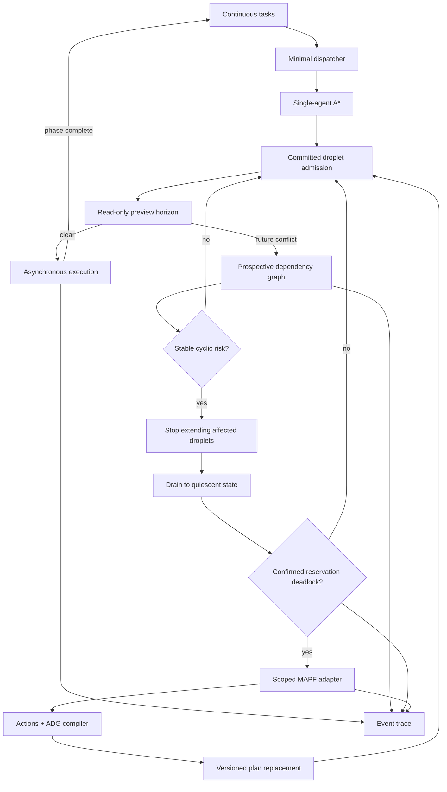

# System Architecture

## Design principles

1. **Normal operation stays simple.** Single-agent A* and traffic admission are
   the default path. MAPF is paid for only when local coordination is necessary.
2. **Planning and execution are separate.** A collision-free synchronized plan
   is not automatically safe under asynchronous execution.
3. **Simulation state is authoritative.** v0.1 has one authoritative robot
   state. Recovery starts from current simulated positions and committed
   resources, never from an assumed schedule position.
4. **Safety rules are explicit invariants.** They are enforced independently of
   a specific solver or visualization.
5. **The simulation is deterministic.** Asynchrony is modeled through phased
   ticks and independently timed actions, not wall-clock timing or
   nondeterministic threads.
6. **Integrations are adapters.** Solvers, visualizers, and future robot
   interfaces remain outside the domain kernel.

## Conceptual flow



## Proposed modules

### Domain

Owns stable vocabulary and state transitions:

- `Robot`: current position or in-progress move, nominal motion state, payload
  state, active task, and plan version.
- `Task`: pickup, drop-off, assignee, and the observable phase sequence
  `pending -> assigned -> to-pickup -> carrying -> to-drop-off -> completed`.
  Assignment and pickup transitions are preserved even when a robot begins on
  the pickup cell.
- `Action`: movement or wait, resource claims, dependencies, version, and
  lifecycle state.
- `Plan`: an ordered, versioned set of actions for one robot.
- `Reservation`: resource owner and release condition.

Action identity is deterministic and plan-local: `(robot_id, plan_version,
action_index)`. A robot increments its plan version whenever a validated plan
is installed, including normal task-phase changes. A failed planning attempt
does not consume a version.

The only v0.1 action kinds are `move` and finite `wait`. There is no indefinite
stay action and no blocked action. A completed plan leaves the robot's current
occupancy authoritative. Seeded execution delay extends the progress of the
currently running action and is not inserted into the plan as another action.

During a multi-tick move, the robot's authoritative position remains the source
cell until completion. The source occupancy is retained, while the undirected
edge and target vertex remain committed. Completion atomically transfers
occupancy to the target.

The domain package must not import a solver, renderer, database, or wall clock.

### Task stream and dispatch

Produces deterministic pickup-and-delivery work and assigns idle robots. The
dispatcher deliberately uses a simple policy such as nearest-idle assignment;
dispatch optimization is not part of the project's claim.

### Scenario and workload data

Scenario inputs keep static topology, runtime policy, and derived visualization
state separate:

- An ASCII map owns only `floor`, `shelf`, `handoff`, and `delivery` cells.
- A schema-validated scenario owns station identities, initial robots, traffic
  horizons, deterministic delay configuration, dispatcher policy, and task
  generation.
- Lifelong workloads contain explicit bootstrap tasks plus a seeded station-pair
  generator. Experiments still use a finite tick horizon so modes can be
  compared reproducibly.
- Review overlays contain derived routes, route indices, and prospective
  dependencies for design-time rendering. They are not runtime truth and will
  be replaced by trace-derived frames once the simulator exists.

Cross-file validation checks map symbols, station references, unique initial
occupancy, exact parity between review routes and deterministic A*, route
adjacency, vertex/edge committed-claim exclusivity, and whether declared
preview dependencies match occupied or committed resources. Review data is
temporary executable scenario design input; it must not be treated as runtime
evidence or extended into a second traffic implementation.

### Routing

Provides a single-agent A* implementation or adapter for normal routing. It
returns spatial paths and does not own traffic reservations or execution state.
It considers static traversability only, uses Manhattan distance, returns paths
including both start and goal, and returns a typed no-path result on failure.
Equal-cost choices use the fixed neighbor priority south, west, east, then
north so seeded scenarios remain reproducible.

### Traffic

Traffic separates exclusive motion authority from read-only prediction:

- The committed droplet contains the next `K` route actions. It validates and
  owns their vertex and edge resources, replenishes the rolling frontier, and
  releases completed resources at deterministic tick boundaries.
- Initial acquisition of the committed horizon is atomic. A shorter safe prefix
  may be reported for diagnostics but is not committed and does not authorize
  cruise execution.
- The preview horizon inspects the following `K` actions, giving a total route
  lookahead of `2K`. It creates no reservation and cannot block another robot.
- A preview action that encounters another robot's occupied or committed
  resource records a prospective dependency with the resource and owning plan
  version. Preview-versus-preview overlap is only diagnostic contention.
- When a prospective cycle is contained, traffic stops extending the affected
  droplets while already authorized progress drains to a deterministic stop.

Traffic does not classify deadlocks or invoke MAPF directly.

The initial generic stopping-distance model is:

```text
stopping_distance = nominal_speed * reaction_time
                  + nominal_speed^2 / (2 * deceleration)
K = ceil(stopping_distance / cell_size) + safety_margin
preview_horizon = K
total_lookahead = 2K
```

All values are synthetic, documented configuration. No hardware-derived private
curve or parameter is used.

### Deadlock analysis

Deadlock analysis has two deliberately separate stages:

1. Build `robot -> set[blocking_robot]` prospective dependencies when preview
   actions encounter occupied or committed resources. A stable SCC is a cyclic
   risk, not yet a hard deadlock.
2. Contain the affected group, let already authorized actions reach quiescence,
   and recompute the required motion-authority claims. The condition becomes a
   hard reservation deadlock only if the circular wait persists and no member
   has committed progress capable of releasing the blocking resource.

Robots need not be physically adjacent. Deadlock is defined by circular
resource ownership and required motion authority under the current plans. Graph
edges carry enough evidence to expire when a resource, owner, or plan version
changes.

The graph algorithm is replaceable. Tarjan's algorithm is an implementation
choice, not a product feature.

### Recovery orchestration

Coordinates the transition from normal traffic to scoped MAPF recovery:

1. Observe a stable prospective dependency SCC.
2. Select the affected robot set.
3. Stop extending normal-route droplets for those robots.
4. Let already authorized progress reach a well-defined quiescent state.
5. Recompute required claims and confirm a hard reservation deadlock.
6. Release their unexecuted future reservations while preserving actual
   occupancy.
7. Snapshot current positions, current phase goals, and relevant obstacles.
8. Call the MAPF adapter.
9. Reject invalid or unsupported solutions.
10. Compile valid paths into dependency-aware actions.
11. Increment plan versions and replace remaining plans atomically.
12. Return the robots to normal admission and execution.

Plan splice is a group transaction, not a loop of single-robot installs. Before
any mutation, recovery stages the complete affected set, expected current plan
versions, validated replacement plans, future reservations to release, and
occupancies that must be preserved. It then validates every version, plan
start, ADG, and reservation change before committing the whole set as one state
transition. Failure leaves every robot, version, occupancy, and reservation
unchanged; a failed candidate consumes no plan version.

### MAPF adapter

Defines a narrow solver boundary. Solver-specific configuration, timeouts, and
third-party data structures remain behind the adapter. The domain receives a
validated solution or a typed failure; it never receives a partially trusted
solver result.

### ADG compiler and executor

The compiler converts a synchronized MAPF solution into actions with:

- sequential dependencies within each robot plan;
- cross-robot precedence between ordered visits to a shared vertex: the later
  entry depends on the earlier occupant's departure;
- explicit vertex and edge claims;
- cycle validation and rejection of unsupported execution patterns.

The MAPF adapter contract is a set of synchronized position sequences with
stay-at-goal semantics. Before compilation, the solution is rejected if an
action moves more than one grid edge, configurations contain a vertex
collision, transitions contain an opposite-edge swap, or paths have unequal
synchronized lengths. Repeated cells compile to finite wait actions. Trailing
goal waits may be removed after validation because terminal occupancy remains
authoritative. The compiler rejects an ADG cycle rather than attempting to
execute a synchronized rotation that cannot be serialized by these rules.

The executor starts an action only when its plan version is current, all
dependencies are complete, and its claims are valid. Actions may require
different deterministic numbers of ticks, so robots complete independently
without nondeterministic threads.

### Simulation and observability

The simulator owns a deterministic phased tick loop and configured action-delay
schedule. Each tick completes due actions, releases resources, evaluates new
requests from a stable snapshot, starts admitted actions, and records trace
output in a fixed order. Metrics and visualization consume the append-only trace
rather than reading or mutating the execution kernel.

The static scenario renderer is a design tool, not part of the execution
kernel. It uses the same map and validated review-frame contract so early
bitmaps can later be regenerated from trace-derived state without moving traffic
logic into visualization.

## Core invariants

The first implementation must encode and test at least these invariants:

1. No simulated vertex is occupied by more than one robot.
2. Two robots cannot traverse the same undirected edge in opposite directions
   during overlapping intervals.
3. A committed resource has one owning plan version.
4. A stale action or completion event cannot mutate a newer plan version.
5. An action cannot start before all dependencies complete.
6. Unexecuted reservations may be released; current occupancy may not be
   released by planning alone.
7. A solver failure leaves affected robots stopped in a diagnosable fail-safe
   state.
8. A preview claim never owns a resource and cannot displace a committed claim.

## Architectural boundary

MAPF Splice demonstrates an integration pattern, not a deployable fleet manager.
Future adapters may connect the kernel to real systems, but v0.1 deliberately
keeps persistence, networking, physical geometry, and vendor protocols outside
the architecture.
