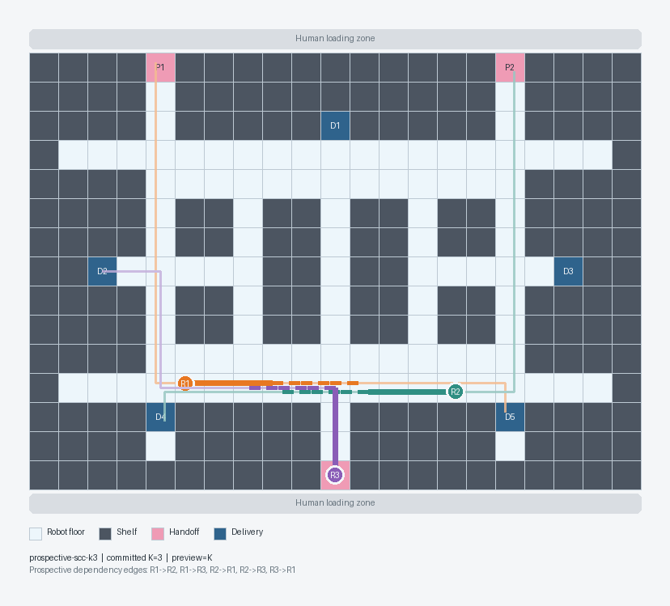

# Demo and Technical Article Plan

## Communication goal

The audience should understand the value proposition from a short animation:

> A robot fleet can keep its existing task dispatcher, independent routing, and
> rolling traffic reservations. When local rules cannot resolve a hard
> deadlock, MAPF can synthesize the maneuver for only the affected robots, and
> ADG execution can safely carry it out despite robot delays.

## Hero environment

The demo uses a compact warehouse grid with:

- visible shelves and constrained aisles;
- pickup and drop-off stations;
- enough alternate space for meaningful retreat and passing maneuvers;
- a continuous, deterministic task stream;
- visually distinct empty and carrying robots;
- a deterministic timing policy shared by every comparison mode. The canonical
  hero uses zero normal-operation delay so topology and traffic policy alone
  establish the SCC; an explicit delayed recovery action later demonstrates
  asynchronous ADG execution.

The first scenario should create deadlocks naturally from task traffic rather
than start in a pre-constructed deadlock configuration.



The canonical `21 × 15` robot grid keeps human loading zones outside the routing
graph. Three boundary handoff stations feed five carrying-only delivery berths.
The bootstrap workload creates a real three-robot prospective SCC with multiple
blockers; the upper loop remains available for scoped MAPF recovery. Generated
runtime replays support `K=3`, `K=4`, and `K=5` without `review.json`.

The checked-in bitmap is a legacy design rendering rather than runtime
evidence. New screenshots and animation should select frames from a replay
generated by:

```bash
uv run mapf-splice-run \
  --scenario scenarios/compact-three-robot/scenario.json \
  --committed-horizon 3 \
  --until quiescence \
  --max-ticks 200 \
  --output artifacts/hero-k3.run.json
```

The deprecated compatibility command is:

```bash
uv run mapf-splice-render \
  --scenario scenarios/compact-three-robot/scenario.json \
  --review scenarios/compact-three-robot/review.json \
  --view prospective-scc-k3 \
  --output docs/assets/compact-three-robot-warehouse.png
```

The first executable vertical slice demonstrates MAPF Splice alone. The
rule-based side-by-side comparison follows after the core traffic, containment,
recovery, and ADG flow works end to end.

## Main comparison

Two side-by-side runs receive the same scenario inputs.

### Rule-based traffic

- Minimal dispatcher and independent A* routes.
- The same committed-droplet and preview-horizon policy as MAPF Splice.
- A small, documented heuristic set, such as fixed priority and one-node
  backtracking.
- Safe admission but possible deadlock, livelock, oscillation, or throughput
  collapse.

The comparison must not implement intentionally weak rules. The point is that
reasonable local heuristics are scenario-dependent and difficult to compose,
not that all rule-based control is ineffective.

### MAPF Splice

- Identical normal task, routing, droplet, and timing behavior.
- Stable prospective-cycle containment followed by confirmed wait-for SCC
  detection.
- Visible selection of a local recovery group.
- MAPF-generated retreat, passing, or rerouting maneuver.
- ADG execution with at least one delayed robot.
- Return to the continuing task stream after recovery.

## Visual language

The animation should make hidden runtime state visible:

- planned A* route: thin robot-colored line;
- committed droplet: translucent reserved cells and edges;
- read-only preview horizon: dashed or lighter continuation beyond the droplet;
- preview conflict: highlighted committed resource and prospective blocker
  edge;
- stable cyclic risk: an amber directed overlay and candidate-group outline;
- confirmed hard-deadlock SCC: a red common outline around the selected group;
- MAPF recovery path: brighter replacement route;
- unmet ADG dependency: labeled waiting indicator;
- delayed robot: clear status marker;
- completed recovery: transition back to normal visual styling.

The visualizer must remain a trace consumer. It must not contain planning,
traffic, or execution decisions.

## Metrics shown at the end

- completed tasks;
- throughput;
- makespan or elapsed simulation time;
- total waiting time;
- hard deadlocks detected;
- recoveries attempted and completed;
- MAPF solve time;
- robots replanned per recovery;
- safety invariant violations;
- optional reservation utilization.

## Suggested animation sequence

1. Introduce the warehouse, robots, tasks, and normal A* routes.
2. Reveal committed droplets as robots maintain cruise motion authority and
   carry loads.
3. Extend the view beyond each committed droplet to reveal the read-only preview
   horizon.
4. Show a prospective dependency cycle while the robots are still separated.
5. Stop extending the affected droplets and let the robots reach safe,
   deterministic quiescent positions.
6. Confirm that the reservation cycle persists and highlight the small subset
   sent to MAPF.
7. Reveal the solver-generated recovery maneuver.
8. Show the ADG dependency order while one robot is delayed.
9. Resume continuous work and present final metrics. A later comparison cut may
   place the rule-based run beside the same scenario.

## Technical article outline

1. **The integration gap**

   A MAPF solver returns a synchronized plan, while a fleet system has continuous
   tasks, rolling reservations, delays, and existing traffic control.

2. **Why local rules grow**

   Explain the usefulness and compositional limits of priority, yielding, and
   backtracking rules without dismissing them as inherently bad.

3. **Normal operation**

   Minimal dispatch, independent A*, committed droplets, preview horizons,
   admission, and deterministic progress.

4. **Recognizing a hard deadlock**

   Prospective dependencies, stable cyclic risk, containment, confirmed
   wait-for graph, SCC cycle core, and progress-aware stability.

5. **MAPF as an intervention**

   Snapshot the authoritative simulation state, solve only the affected group,
   validate the result, and replace live plans.

6. **From synchronized plan to asynchronous execution**

   ADG compilation, dependency completion, resource claims, and plan versions.

7. **Results**

   Animation, trace, metrics, seeded comparisons, and failure behavior.

8. **Limits and next steps**

   Footprints, idle blockers, physical adapters, richer dispatch, and stronger
   liveness arguments.

## Acceptance criteria for the communication artifacts

- A viewer can identify the deadlock and recovery group without narration.
- The animation shows why MAPF and ADG solve different problems.
- The comparison uses identical workload and delay inputs.
- The article states all modeling assumptions and non-goals.
- The repository contains one canonical command for reproducing the published
  demo, trace, and metrics.
